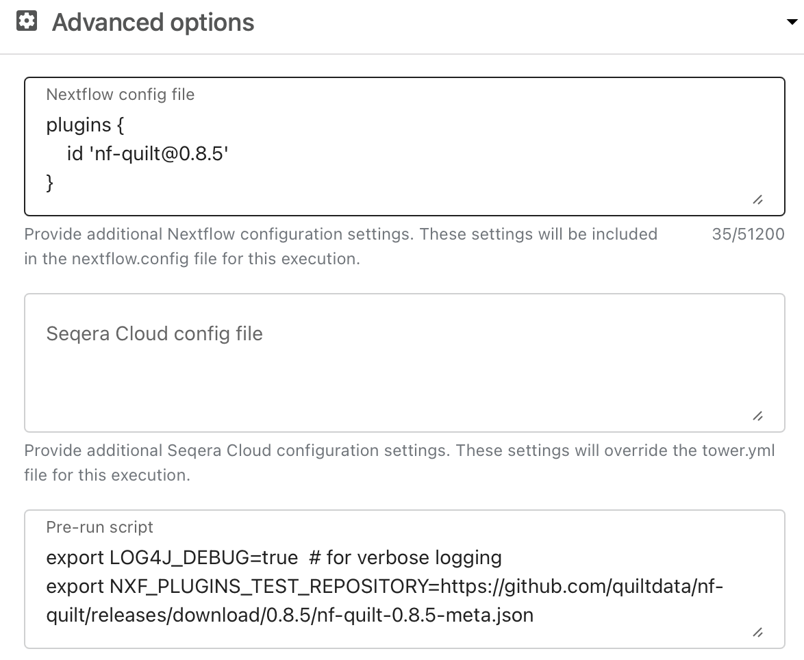

# Developer Documentation

## Using Pre-Release Versions

Occasionally we will release beta versions of the plugin that are not yet available in the Nextflow plugin registry. You can help test these versions as follows:

- Set the `NXF_PLUGINS_TEST_REPOSITORY` environment variable to the URL of the plugin's metadata file
- Specify the plugin version in the `plugins` section of your `nextflow.config` file

From the command-line, do, e.g.:

```bash
export LOG4J_DEBUG=true  # for verbose logging
export NXF_PLUGINS_TEST_REPOSITORY=https://github.com/quiltdata/nf-quilt/releases/download/0.8.5/nf-quilt-0.8.5-meta.json
nextflow run main.nf -plugins nf-quilt@0.8.5
```

For Tower, you set the environment variables in the "Pre-run script".



## Using Development Versions

If you want to use edge versions of nf-quilt, you must run it with a development
version of `nextflow`. The simplest way to do that is to pull them both directly
from GitHub:

```bash
git clone https://github.com/nextflow.io/nextflow.git
git clone https://github.com/quiltdata/nf-quilt.git
cd ./nf-quilt
```

### Verifying Nextflow

If this is your first time using Nextflow, you may also need to install a recent
[version of Java](https://www.java.com/en/download/help/download_options.html)
for your platform. Nextflow itself will take care of all the other dependencies.

You can verify and compile Nextflow with:

```bash
make nextflow
```

## Running from Git

To quickly run `nf-quilt` from this GitHub repository:

```bash
# install and compiles dependencies, then test
make test-all 
# create "test/hurdat" package on s3://$WRITE_BUCKET
make pkg-test WRITE_BUCKET=your-writeablebucket 
```

This ensures you have properly installed Nextflow and configured your local
<--markdownlint-disable-next-line MD041-->
[AWS credentials](https://docs.aws.amazon.com/cli/latest/userguide/cli-configure-files.html).

You can also set WRITE_BUCKET and other parameters in a `.env` file in the
project root, and they will be automatically read by the Makefile.

### Running a Pipeline Locally

From inside the `nf-quilt` directory, call `./launch.sh` with a path to your
pipeline.

For example, with a standard `nf-core` pipeline like `sarek`:

```bash
./launch.sh run nf-core/sarek -profile test,docker -plugins nf-quilt --outdir "quilt+s3://bucket#package=nf-quilt/sarek"
```

Otherwise, replace `nf-core/sarek` with the local path to your pipeline's `.nf`
file (be sure to rename the `outdir` parameter if you use different convention).
For example:

```bash
   ./launch.sh run ./main.nf -profile standard -plugins $(PROJECT) --outdir "quilt+s3://bucket#package=test/hurdat"
```

### Unit Testing

You can cleanly compile and run all unit tests with:

```bash
make check
```

To show the output of the tests, use:

```bash
make verify
```

To fast-fail on the first failing test, use:

```bash
make fast
```

## Publishing the Plugin for Others to Use

If your system is properly configured, use `make publish` to package, upload,
and publish the plugin.

Otherwise, follow these steps:

1. Create a file named `gradle.properties` in the project root containing the
   following attributes (this file should not be committed to Git):

   - `github_organization`: the GitHub organisation where the plugin repository
     is hosted.
   - `github_username`: The GitHub username granting access to the plugin
     repository.
   - `github_access_token`: The GitHub access token required to upload and
     commit changes to the plugin repository.
   - `github_commit_email`: The email address associated with your GitHub
     account.

2. Use the following command to package and create a release for your plugin on
   GitHub:

   ```bash
   ./gradlew :plugins:nf-quilt:upload
   ```

3. Fork the [nextflow-io/plugins](https://github.com/nextflow-io/plugins)
   repository to one you can write to

4. Use the following command to publish your plugin to your fork:

   ```bash
   ./gradlew :plugins:publishIndex
   ```

5. Create a pull request to push your changes back to
   [nextflow-io/plugins](https://github.com/nextflow-io/plugins/blob/main/plugins.json)
