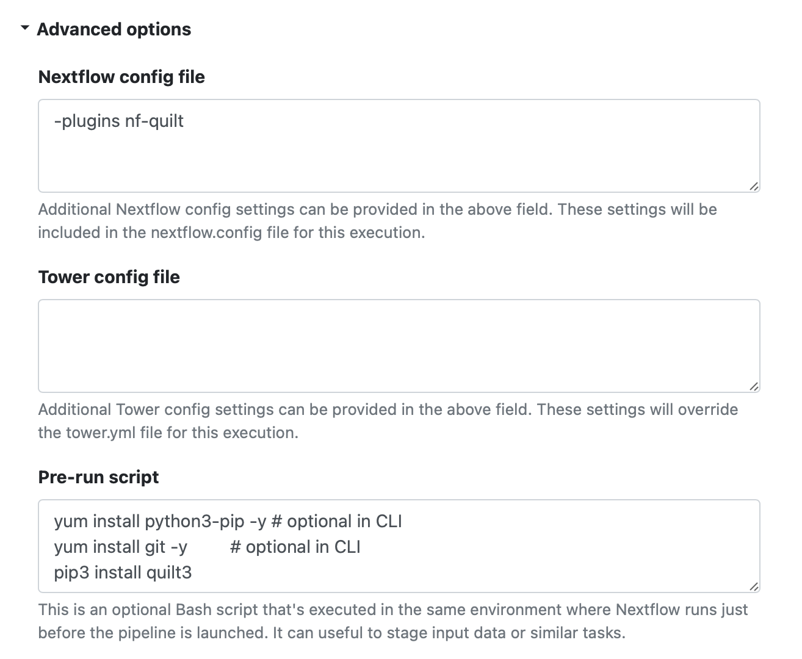

# nf-quilt

NextFlow plugin for reading and writing Quilt packages as a FileSystem

[`nf-quilt`](https://github.com/quiltdata/nf-quilt) (v0.3.2 or later) is a NextFlow [plugin](https://www.nextflow.io/docs/latest/plugins.html)
developed by [Quilt Data](https://quiltdata.com/) that enables you read and write directly
to Quilt packages using `quilt+s3` URIs wherever your NextFlow pipeline currently use `s3` URIs.

Inspired by the original [`nf-quilt`](https://github.com/nextflow-io/nf-quilt) plugin (v0.2.0) developed by Seqera labs

## I. Using the nf-quilt plugin in Production

This plugin allows your existing pipelines, without modification,
to read and write versioned Quilt packages stored on Amazon S3.

Use the following four steps to configure NextFlow Tower or your command-line environment.

1. Install the `quilt3` command-line tool

This is distributed as an open source Python package you can install using `pip3`,
and must be available in the PATH used by `nextflow`.

```bash
yum install python3-pip -y
yum install git -y        
pip3 install quilt3
which quilt3
```

The above instructions use the 'yum' package manager, which NextFlow Tower uses in the "Pre-run script" when you edit the Pipeline settings from the Launchpad.
If you are running from the command-line, you may need to use your own package manager
(or just skip those lines if you already have Python and Git).

1. Enable the `nf-quilt` plugin

The usual way to enable a plugin is to add the following to your `nextflow.config` file,
or (in Tower) the "Advanced Options ->  Nextflow config file":

```groovy
plugins {
    id 'nf-quilt'
}
```



You can alternatively specify the plugin as part of the command-line, .e.g.:

```bash
nextflow run ./main.nf -profile standard -plugins nf-quilt --outdir 'quilt+s3://bucket#package=prefix/suffix'
```

1. Obtain a Quilt+ URI for each package

Each Quilt+ package URI you read or write from has the form:

```string
quilt+s3://bucket#package=prefix/suffix
```

You must have the appropriate read or write permissions for that `bucket`,
and your environment must have the corresponding
[AWS credentials](https://docs.aws.amazon.com/cli/latest/userguide/cli-configure-files.html).

In the Quilt catalog, you can find the Quilt+ URI for an existing package
in the `<> CODE | URI` section at the top.
You can also manually create URIs for new packages that don't yet exist.

1. Set the appropriate parameter(s) in your pipeline

For `nf-core` pipelines, use `--input` to read and `--outdir` to write.
Otherwise, whatever is passed to `Channel.fromPath` as input
and to `publishDir` as outdir.

You can also specify these as YAML to pass to `-params-file`:

```yaml
input: "quilt+s3://quilt-example#package=examples/hurdat"
outdir: "quilt+s3://seqera-quilt#package=test/hurdat"
```

Note that `--key` on the command-line corresponds to `params.key` in your script.

## II. Running from Git

To quickly run `nf-quilt` from this GitHub repository:

```bash
git clone https://github.com/quiltdata/nf-quilt.git
cd nf-quilt
make test-all # runs unit tests and installs depdencies
export WRITE_BUCKET=bucket-with-write-access
make pkg-test  # create "test/hurdat" package on s3://$WRITE_BUCKET
./launch.sh run nf-core/sarek -profile test,docker -plugins nf-quilt \
            --outdir "quilt+s3://$WRITE_BUCKET#package=nf-quilt/sarek"
```

### Using Development Versions

If you want to use an unpublished plugin, you must run it with a development version of `nextflow`.
The simplest way to do that is to pull them both directly from GitHub:

```bash
git clone https://github.com/nextflow.io/nextflow.git
git clone https://github.com/quiltdata/nf-quilt.git
cd ./nf-quilt
```

You also need to use Python to install the `quilt3` command-line tool used by `nf-quilt`:

```bash
pip install quilt3
which quilt3
```

### Unit Testing

You can compile run unit tests with:

```bash
make check
```

### Verifying NextFlow

If this is your first time using NextFlow, you may also need to install a recent
[version of Java](https://www.java.com/en/download/help/download_options.html) for your platform.
NextFlow itself will take care of all the other dependencies.

You can verify and compile NextFlow with:

```bash
make nextflow-22-10
```

### Testing Installation

To verify that the plugin, nextflow, and your AWS credentials have been properly installed,
type:

```bash
   ./launch.sh run ./main.nf -profile standard -plugins $(PROJECT) --pub "quilt+s3://bucket#package=test/hurdat"
```

Replace "bucket" with an S3 bucket those credentials can write to.

### Running a Pipeine Locally

From inside the `nf-quilt` directory, call `./launch.sh` with a path to your pipeline.

For example, with a standard `nf-core` pipeline like `sarek`:

```bash
./launch.sh run nf-core/sarek -profile test,docker -plugins nf-quilt --outdir "quilt+s3://bucket#package=nf-quilt/sarek"
```

Otherwise, replace `nf-core/sarek` with the local path to your pipeline's `.nf` file,
and replace `outdir` with the appropriate parameter for `publishDir`.

## III. Package, upload and publish

The project should be hosted in a GitHub repository whose name should match the name of the plugin,
that is the name of the directory in the `plugins` folder (e.g. `nf-quilt`).

Follow these steps to package, upload and publish the plugin:

1. Create a file named `gradle.properties` in the project root containing the following attributes (this file should not be committed to Git):

   * `github_organization`: the GitHub organisation where the plugin repository is hosted.
   * `github_username`: The GitHub username granting access to the plugin repository.
   * `github_access_token`: The GitHub access token required to upload and commit changes to the plugin repository.
   * `github_commit_email`: The email address associated with your GitHub account.

2. Use the following command to package and create a release for your plugin on GitHub:

   ```bash
   ./gradlew :plugins:nf-quilt:upload
   ```

3. Fork the [nextflow-io/plugins](https://github.com/nextflow-io/plugins) repository to one you can write to

4. Use the following command to publish your plugin to your fork:

   ```bash
   ./gradlew :plugins:publishIndex
   ```

5. Create a pull request to push your changes back to [nextflow-io/plugins](https://github.com/nextflow-io/plugins/blob/main/plugins.json)
