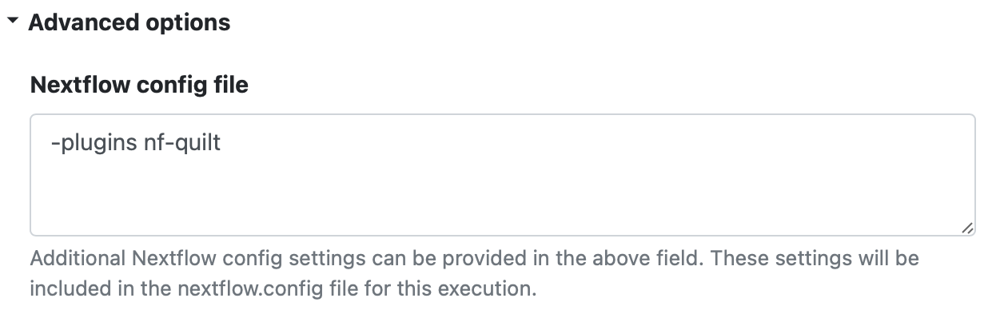
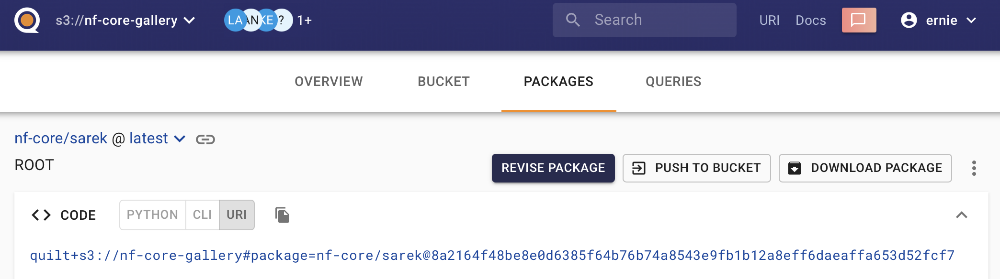

# nf-quilt

Nextflow plugin for reading and writing Quilt packages

[`nf-quilt`](https://github.com/quiltdata/nf-quilt) is a Nextflow
[plugin](https://www.nextflow.io/docs/latest/plugins.html) developed by [Quilt
Data, Inc.](https://quiltdata.com/) that enables you read and write directly to
Quilt packages wherever your Nextflow pipeline currently uses `s3` URIs. It
works with any Amazon S3-compatible object store, as long as you have the
appropriate
[credentials](https://docs.aws.amazon.com/cli/latest/userguide/cli-configure-files.html).

Quilt packages are versioned, immutable, and shareable data containers that
store data, metadata, and documentation as a single atomic unit. They are
accessible even by non-technical users via the Quilt Platfrom, a graphical
web catalog which runs either in your private AWS cloud or on
[open.quiltdata.com](https://open.quiltdata.com).

## Writing to Quilt Packages

For example, if your current pipeline writes to an S3 bucket specified by the
environment variable `$WRITE_BUCKET`:

```shell
nextflow run nf-core/rnaseq --outdir "s3://$WRITE_BUCKET/nf_quilt/rnaseq"
```

All you have to do is add the `nf-quilt` plugin to your command line:

```shell
nextflow run nf-core/rnaseq -plugins nf-quilt --outdir "s3://$WRITE_BUCKET/nf_quilt/rnaseq"
```

This will automatically create a nicely-formmated Quilt package with all the
metadata from that run.

## Use nextflow.config to configure the plugin

To avoid having to manually specify the plugin, you can add it to your `nextflow.config` file:

```groovy
plugins {
    id 'nf-quilt'
}
```

This also works with Nextflow Tower, where you can add the plugin to the
"Advanced Options -> Nextflow config file".



As of v0.9+, you can also add a `quilt` section to your `nextflow.config` file to specify the metadata and other plugin behaviors:

```groovy
quilt {
    catalog = 'open.quiltdata.com'
    force = false  // replace (instead of update) existing packages
    meta = [pipeline: 'nf-core/rnaseq']
}
```

See "Configuration" below for more details.

## Working With Quilt+ URIs (Optional)

When using the `nf-quilt` plugin, you can use Quilt+ URIs (instead of S3 URIs)
to specify the package you want to read or write. For example, the URI for the
package created from the initial example would be:

```shell
quilt+s3://$WRITE_BUCKET#package=nf_quilt/rnaseq
```

### Input URIs

Versioned Quilt+ URIs can be used as input URIs in your Nextflow pipeline, to ensure you know precisely which data you are using. For example, this is a specific version of the output from `nf-core/sarek`:

```shell
quilt+s3://$READ_BUCKET#package=nf-core/sarek@8a2164f48be8e0d6385f64b76b74a8543e9fb1b12a8eff6daeaffa653d52fcf7
```

If are using the Quilt Platform, you can find the Quilt+ URI for a package in the `<> CODE | URI` section at the top of the package page.



### Output URIs

You can specify a Quilt+ URI as the `--outdir` parameter in your Nextflow pipeline if you want to specify the package name and metadata for the output,
but don't care about the precise location in S3. For example:

```shell
nextflow run nf-core/rnaseq --outdir "quilt+s3://$WRITE_BUCKET?key=value#package=nf_quilt/rnaseq"
```

The `key=value` part is optional, and can be used to specify metadata for the
package, which will be added to the metadata automatically generated by the
plugin. This is particularly when working with [Quilt
workflows](https://docs.quiltdata.com/workflows), which require specific
metadata to be present before a package can be created.

### CLI Usage

If your workflow supports `--input` and `--outdir` parameters, you can use them to specify the Quilt+ URIs. For example:

```shell
nextflow run main.nf --input "quilt+s3://$READ_BUCKET#package=nf-core/sarek@8a2164f48be8e0d6385f64b76b74a8543e9fb1b12a8eff6daeaffa653d52fcf7" --outdir "quilt+s3://$WRITE_BUCKET?key=value#package=test/my-sarek-processor"
```

Note that you need to quote the URIs to prevent the shell from interpreting the `?` and `#` characters.

## Configurations

There are a number of additional parameters you can set in order to customize
the behavior of the plugin:

* **catalog**: specify the DNS hostname of the Quilt catalog to use (default: None)
* **force**: completely replace the existing package, rather than updating it (default: `false`)
* **meta**: specify a map of metadata to add to the package (default: `{}`)
* **msg**: specify the commit message template to use when saving the package
* **pkg**: specify the name of the package to read or write, when using an S3 URI (default: the first two path components)
* **readme**: specify a template string for the package README_NF_QUILT.md file
* **workflow**: specify the name of a Quilt workflow on that bucket to use for metadata validation (default: None)

NOTE: These configurations were previously specified as part of the Quilt+ URI.
That functionality has mostly been removed.
The Quilt+ URI fragment (`#`) is now only used to specify the package and (optionally) the path and workflow.
You may continue to use the query string (`?`) to specify metadata, including the `catalog`.

### Template Strings

Version 0.3.4 and later allow you to customize both the `msg`
and `readme` via template strings that use these `${variables}`:

* `cmd`: the current command line
* `meta`: the complete metadata
* `msg`: the current commit message
* `nextflow`: the current Nextflow configuration
* `now`: the ISO 8601 date and time
* `pkg`: the package name

Note that the full `meta` is usually extremely large. You should use conditional
keys to extract only the metadata you need, if present. For example:

```groovy
quilt {
    meta = [pipeline: 'nf-core/rnaseq']
    msg = "${meta['config']?.get('runName')}: ${meta['cmd']}"
    readme = '''
# ${pkg}

## ${now}

## Run Command

${cmd}

### Workflow

- **workflow run name**: ```${meta['workflow']?.get('runName')}```
- **scriptFile**: ```${meta['workflow']?.get('scriptFile')}```
- **sessionI**: ```${meta['workflow']?.get('sessionId')}```
- **start**: ```${meta['time_start']}```
- **complete**: ```${meta['time_complete']}```

### Nextflow

${nextflow}

### Processes

`${meta['workflow']?.get('stats')?.getAt('processes')}`
    '''
}
```
