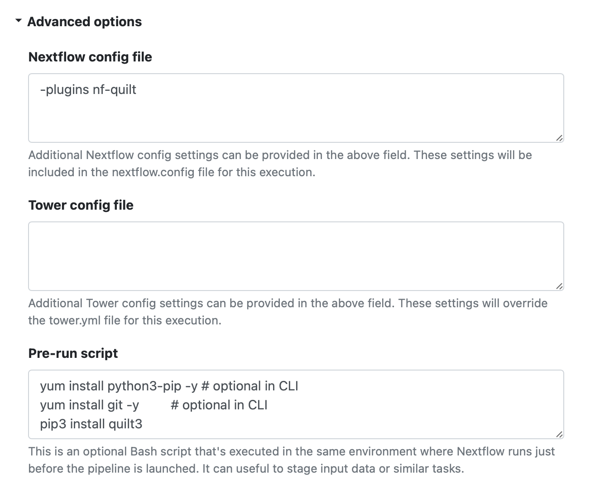

# nf-quilt

NextFlow plugin for reading and writing Quilt packages as a FileSystem

[`nf-quilt`](https://github.com/quiltdata/nf-quilt) (v0.3.2 or later) is a NextFlow [plugin](https://www.nextflow.io/docs/latest/plugins.html)
developed by [Quilt Data](https://quiltdata.com/) that enables you read and write directly
to Quilt packages using `quilt+s3` URIs wherever your NextFlow pipeline currently use `s3` URIs.

Inspired by the original [`nf-quilt`](https://github.com/nextflow-io/nf-quilt) plugin (v0.2.0) developed by Seqera labs.

See [DEVELOPMENT.md](doc/DEVELOPMENT.md) for details on running from the git repository.

## I. Using the nf-quilt plugin in Production

This plugin allows your existing pipelines, without modification,
to read and write versioned Quilt packages stored on Amazon S3.

Use the following four steps to configure NextFlow Tower or your command-line environment.

1. Install the `quilt3` command-line tool

This is distributed as an open source Python package you can install using `pip3`,
and must be available in the PATH used by `nextflow`.

```bash
yum install python3-pip -y
yum install git -y        
pip3 install quilt3
which quilt3
```

The above instructions use the 'yum' package manager,
which NextFlow Tower uses in the "Pre-run script"
when you edit the Pipeline settings from the Launchpad.

If you are running from the command-line, you may need to use your own package manager
(or just skip those lines if you already have Python and Git).

1. Enable the `nf-quilt` plugin

The usual way to enable a plugin is to add the following to your `nextflow.config` file,
or (in Tower) the "Advanced Options ->  Nextflow config file":

```groovy
plugins {
    id 'nf-quilt'
}
```



You can alternatively specify the plugin as part of the command-line, .e.g.:

```bash
nextflow run ./main.nf -profile standard -plugins nf-quilt --outdir 'quilt+s3://bucket#package=prefix/suffix'
```

1. Obtain a Quilt+ URI for each package

Each Quilt+ package URI you read or write from has the form:

```string
quilt+s3://bucket#package=prefix/suffix
```

You must have the appropriate read or write permissions for that `bucket`,
and your environment must have the corresponding
[AWS credentials](https://docs.aws.amazon.com/cli/latest/userguide/cli-configure-files.html).

In the Quilt catalog, you can find the Quilt+ URI for an existing package
in the `<> CODE | URI` section at the top.
You can also manually create URIs for new packages that don't yet exist.

See 'Advanced Options' below for more details.

1. Set the appropriate parameter(s) in your pipeline

For `nf-core` pipelines, use `--input` to read and `--outdir` to write.
Otherwise, whatever is passed to `Channel.fromPath` as input
and to `publishDir` as outdir.

You can also specify these as YAML to pass to `-params-file`:

```yaml
input: "quilt+s3://quilt-example#package=examples/hurdat"
outdir: "quilt+s3://seqera-quilt#package=test/hurdat"
```

Note that `--key` on the command-line corresponds to `params.key` in your script.

1. Optional: use a pre-release plugin

If a plugin is not yet available in the NextFlow plugin registry, you can use a pre-release version.
From the command-line, do, e.g.:

```bash
export NXF_VER=23.04.0
export NXF_PLUGINS_TEST_REPOSITORY=https://github.com/quiltdata/nf-quilt/releases/download/0.3.5/nf-quilt-0.3.5-meta.json
nextflow run main.nf -plugins nf-quilt@0.3.5
```

For Tower, you can use the "Pre-run script" to set the environment variables.

## II. Advanced URI Options

There are a number of additional paramters you can add to Quilt+ URIs,
in order to customize the behavior of the plugin:

* Fragment Parameters:
  * **catalog**: specify the DNS hostname of the Quilt catalog to use (default: `open.quiltdata.com`)
  * **package**: specify the name of the package to read or write (default: `.`)
  * **path**: specify a path within the package to read or write (default: `.`) [not fully supported yet]
  * **workflow**: specify the name of a workflow to use for metadata validation (default: none)

* Query Parameters: also stored as package-level metadata
  * **benchling.experiment_id**: specify a Benchling notebook to push this Quilt+ URI to, as a metadata Field [preview]
  * **commit_message**: specify the commit message to use when saving the package
  * **readme**: specify a Groovy GString template for the package README
  * **_any other key_**: specify any other metadata key to store in the package

See below for more details.  
When running from the git repository,
you can use the Makefile to test the various options,
as long as you set a WRITE_BUCKET:

```bash
export WRITE_BUCKET=bucket-with-write-access
make pkg-test  # create "test/hurdat" package on s3://$WRITE_BUCKET
```

### A. Quilt+ URIs for Metadata Workflows

Sometimes you may want to ensure the created package contains specific metadata.
This is done using [Quilt workflows](https://docs.quiltdata.com/advanced/workflows).
Specify the workflow name as an additional `workflow=` fragment parameter,
and any metadata properties as part of the query string.

```bash
make pkg-test QUERY='?mkey1=val1&mkey2=val2' FRAGMENT='&workflow=my_workflow'
```

Note that specifying a workflow means that package creation will fail (and nothing will be saved)
if the query string does not contain all the required metadata,
so you should carefully test it before running long jobs.

### B. Quilt+ URIs for Custom Data Products

Version 0.3.4 and later allow you to customize both the `commit_message`
and `readme` via metadata query keys:

```bash
make pkg-test QUERY='?commit_message=text+str&readme=GStr+%24msg+%24now+%24%7Bmeta[%22quilt%22]%7D'
```

The `readme` parameter is a Groovy GString template which expands the variables:

* `msg`: the current commit_message
* `now`: the ISO 8601 date and time
* `meta`: the complete metadata (very large! use only  subsets)

### C. Benchling Integration (Preview)

Version 0.3.5 includes alpha support for a `benchling.experiment_id`
metadata key in the query parameter:

```bash
make pkg-test QUERY='?benchling.experiment_id=123'
```

After package push, this will add the URI of the output quilt package to a
metadata field in the Benchling notebook.

In order to use this, you must also export two environment variables:

```string
# The URL of your custom Benchling domain (only for paid plans)
export BENCHLING_TENANT=https://mock-benchling.proxy.beeceptor.com/

# The base64 API Key from your Benchling Developer settings
export BENCHLING_API_KEY=R4nd0mB4se64N0mb3r
```

